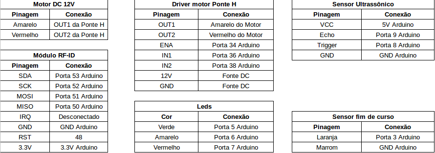

# Controle remoto de porta utilizando MQTT

Projeto de pesquisa desenvolvido no IFSC câmpus São José, com intuito de aprofundar o conhecimento sobre o protocolo MQTT, que é um protocolo de troca de mensagens leves, muito utilizado em aplicações IoT.

## Componentes utilizados

- [Arduino Mega 2560 e Shield Ethernet](./img/arduinomega.png);
- [Motor DC 12V](./img/motor.png);
- [Driver motor Ponte H](./img/ponteh.png);
- [Sensor ultrassônico](./img/ultra.png);
- [Sensor de fim-de-curso](./img/curso.png);
- [Módulo RF-ID](./img/rfid.png);
- [3 Led's e 3 Resistores](./img/leds.png);
- [Estrutura de uma porta de vidro](./img/estrutura.png);
- [Câmera IP](./img/camera.png);
- Fontes DC: 9V para Arduino e 12V para Motor;

## Montagem

Com todos os componentes acima listados, foram feitas as seguintes conexões:

Com essas conexões feitas, foram adaptados os componentes na estrutura da porta, sendo essa estrutura feita de metal, madeira e vidro.

## Funcionamento

O protocolo MQTT resumidamente, funciona utilizando o método Publish/Subscribe, que consiste em clientes trocar mensagens através de um mediador, também chamado de Broker, com um valor e um tópico, que de certa forma é uma etiqueta para a mensagem. Os clientes se conectam ao Broker e assim podem se inscrever ou publicar em tópicos. Quando um cliente se inscreve em um tópico, receberá todas as mensagens publicadas nesse tópico por qualque outro cliente, e quando ele publica em um tópico, todos os clientes inscritos nesse, receberão a mensagem, todo trabalho de direcionamento das mensagens é feito pelo Broker.

O código desse repositório foi criado para trabalhar da seguinte maneira:
Publicar no seguinte tópico:

- Tópico: `Arduino1/porta/status`
- Valores:
    - `1`: Aberto;
    - `2`: Abrindo/fechando;
    - `3`: Aberto.

Inscrever-se no seguinte tópico:

- Tópico: `Arduino1/porta/comandos`
- Valores:
    - `1`: Abrir esperar e fechar;
    - `2`: Somente abrir;
    - `3`: Somente fechar.

Assim o Arduino vai receber todas as mensagens vindas no tópico inscrito e todos os clientes que se inscreverem no tópico que ele está publicando irão receber a mensagem publicada.
